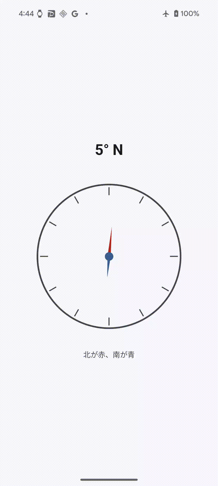

# Digital Compass

Jetpack Compose と Material Design 3 で構築した Android 向けデジタルコンパスアプリです。



## 機能

- リアルタイムの方位表示
- 視覚的なコンパス UI
- 度数と方位（ N 、 NE 、 E 、 SE 、 S 、 SW 、 W 、 NW ）の表示
- Material Design 3 によるモダンな UI
- ダークモード対応

## 技術スタック

- 言語: Kotlin 2.0.21
- UI フレームワーク: Jetpack Compose
- デザインシステム: Material Design 3
- 最小 SDK: 31 （ Android 12 ）
- ターゲット SDK: 35 （ Android 15 ）

## セットアップ

### 必要な環境

- Android Studio Koala | 2024.1.1 以降
- JDK 11 以上
- Android SDK 35

### ビルド手順

1. リポジトリをクローン
```bash
git clone https://github.com/yourusername/DigitalCompass.git
cd DigitalCompass
```

2. Android Studio でプロジェクトを開く

3. デバッグ APK をビルド
```bash
./gradlew assembleDebug
```

4. デバイスにインストール
```bash
./gradlew installDebug
```

## 開発

### プロジェクト構造

```
app/
├── src/
│   └── main/
│       ├── java/t/saito/digitalcompass/
│       │   ├── MainActivity.kt           # メインアクティビティ
│       │   ├── ui/
│       │   │   ├── CompassScreen.kt     # コンパス画面
│       │   │   ├── CompassNeedle.kt     # コンパスの針コンポーネント
│       │   │   └── theme/               # テーマ設定
│       │   └── viewmodel/
│       │       └── CompassViewModel.kt  # コンパスのビジネスロジック
│       └── res/                         # リソースファイル
```

### テスト実行

```bash
# ユニットテストを実行
./gradlew test

# インストルメンテーションテストを実行
./gradlew connectedAndroidTest
```

### コード品質チェック

```bash
# Lint チェック
./gradlew lint
```

## アーキテクチャ

このアプリは MVVM （ Model-View-ViewModel ）アーキテクチャパターンを採用しています：

- View: Jetpack Compose による UI コンポーネント
- ViewModel: センサーデータの管理とビジネスロジック
- Model: センサーデータとドメインロジック

## 主な機能の実装

### センサー管理

`CompassViewModel` がデバイスの磁気センサーと加速度センサーを使用して方位を計算します。

### UI デザイン

- `CompassScreen`: メイン画面のレイアウト
- `CompassNeedle`: アニメーション付きのコンパスの針
- `CompassCircle`: 方位記号と度数マーキング

## パーミッション

このアプリは特別なパーミッションを必要としません。デバイスの内蔵センサーのみを使用します。

## 開発プロセス

このプロジェクトは Claude Code Actions と Claude AI を活用して開発されました：

1. Issue 駆動開発: GitHub Actions の Claude Code Actions で Issue から実装開始
2. AI アシスト開発: Claude AI が要件を解析し、 Kotlin と Jetpack Compose のパターンに沿って実装
3. コード生成支援: センサー管理、 UI コンポーネント、 ViewModel の実装を AI がサポート
4. 品質管理: Material Design 3 のガイドラインに準拠した実装

### Claude Code Actions の活用

- [Issue](https://github.com/takumi-saito/digital-compass/issues?q=is%3Aissue%20state%3Aclosed) に要件を記載し、 Claude が自動的にコードを生成
- Jetpack Compose のパターン適用
- MVVM アーキテクチャ実装
- コードレビューと改善提案

## 貢献

プルリクエストを歓迎します。大きな変更の場合は、まず Issue を作成して変更内容について議論してください。

## ライセンス

[MIT License](LICENSE)

## 作者

T. Saito